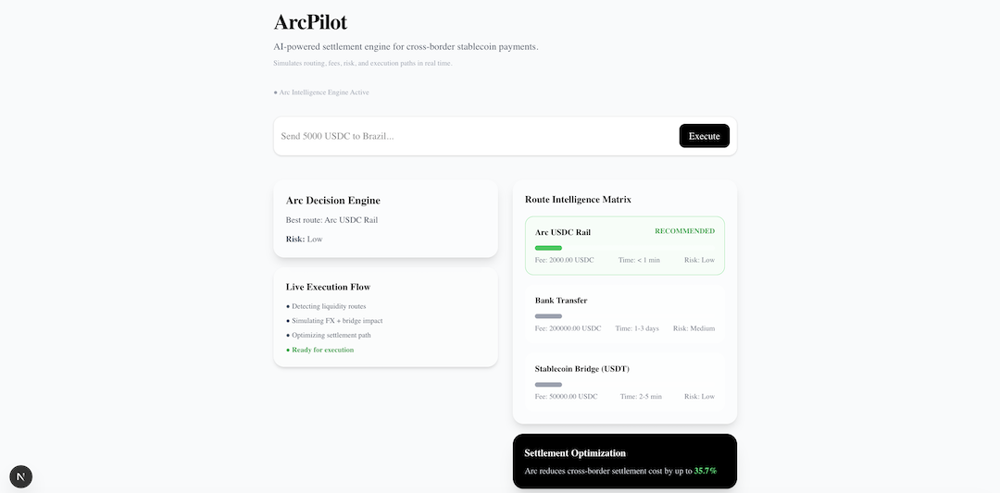

🚀 ArcPilot

  

  <strong>AI-powered settlement engine for cross-border stablecoin payments</strong>

Turn global payments into a real-time intelligent routing problem.

⸻

⚡ What is ArcPilot?

ArcPilot is an AI-powered settlement intelligence layer that optimizes cross-border stablecoin transfers.

Instead of executing transactions blindly, ArcPilot:

* Simulates multiple settlement routes
* Evaluates fees, execution speed, and risk
* Selects the optimal payment path
* Executes settlement using Arc AppKit

The result is a smarter, faster, and more transparent payment experience.

⸻

🧠 The Problem

Cross-border payments today are often:

* ⏳ Slow
* 💸 Expensive
* 🌐 Opaque
* 🔀 Fragmented across multiple payment rails

Users and businesses typically don’t know which route provides the best execution outcome.

⸻

🚀 The Solution

ArcPilot transforms payments into an intelligent routing problem.

Given a payment intent such as:

“Send 5,000 USDC to Brazil”

ArcPilot automatically:

1. Discovers possible settlement routes
2. Simulates execution outcomes
3. Compares fees and timing
4. Assesses risk levels
5. Recommends the best route
6. Executes through Arc infrastructure

⸻

✨ Features

* 🧠 AI-powered route simulation
* ⚡ Real-time settlement optimization
* 💸 Fee comparison engine
* 🛡️ Risk-aware recommendations
* 🌉 Arc AppKit integration
* 🔗 Viem Adapter integration
* 🎞️ Motion-enhanced user experience
* 🧊 Glassmorphism UI

⸻

🏗 Architecture

User Intent
    ↓
ArcPilot Agent
    ↓
AI Route Simulation
    ↓
Arc AppKit
    ↓
Viem Adapter
    ↓
Settlement Execution
    ↓
Execution Result

⸻

🔄 Execution Flow

User Input
↓
Analyze Payment Intent
↓
Simulate Multiple Routes
↓
Evaluate Fee / Speed / Risk
↓
Select Optimal Route
↓
Execute via Arc AppKit
↓
Return Settlement Result

⸻

🧰 Tech Stack

* Next.js
* TypeScript
* Tailwind CSS
* Framer Motion
* Arc AppKit
* @circle-fin/adapter-viem-v2
* viem

⸻

🚀 Arc Integration

ArcPilot leverages Arc infrastructure as its execution layer.

Arc capabilities used:

* Arc AppKit unified send flow
* Stablecoin settlement execution
* BridgeStep transaction abstraction
* Viem Adapter integration
* Adapter capabilities configuration
* Chain abstraction for EVM execution

⸻

💡 Why Arc?

Arc simplifies complex settlement flows into a unified developer experience.

Using Arc AppKit allowed ArcPilot to focus on settlement intelligence and optimization rather than low-level execution details.

⸻

🧪 Demo Mode

ArcPilot supports both:

* Live execution through Arc AppKit
* Simulation fallback mode for demos and testing

⸻

🎥 Demo

The demo showcases:

* Cross-border payment intent input
* Real-time route simulation
* Settlement optimization
* Route recommendation
* Arc-powered execution flow

⸻

🎯 Example Use Case

Input:

Send 5,000 USDC to Brazil

ArcPilot will:

* Compare settlement options
* Identify the cheapest route
* Estimate execution time
* Evaluate risk exposure
* Recommend the optimal path
* Execute using Arc infrastructure

⸻

🏆 Built for

Arc Developer Challenge

ArcPilot demonstrates how AI agents can transform payments into a real-time optimization problem powered by Arc.

⸻

❤️ Author

Built by Rebwar Hosein Poori with ❤️

GitHub:
https://github.com/rebwar
